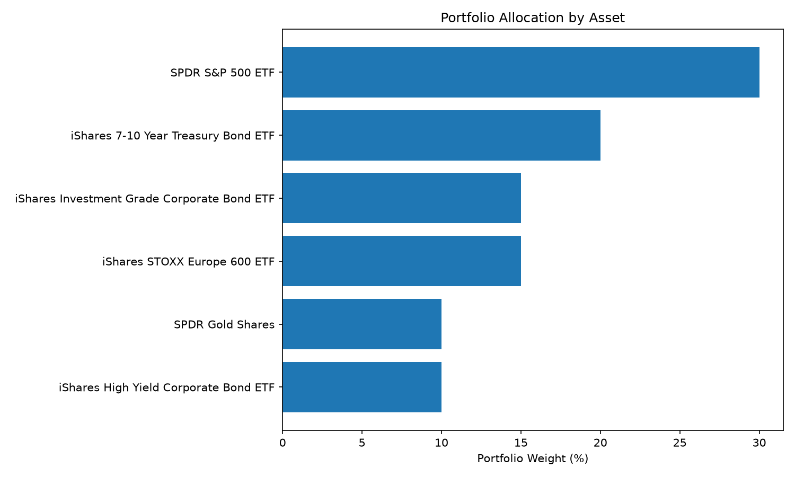
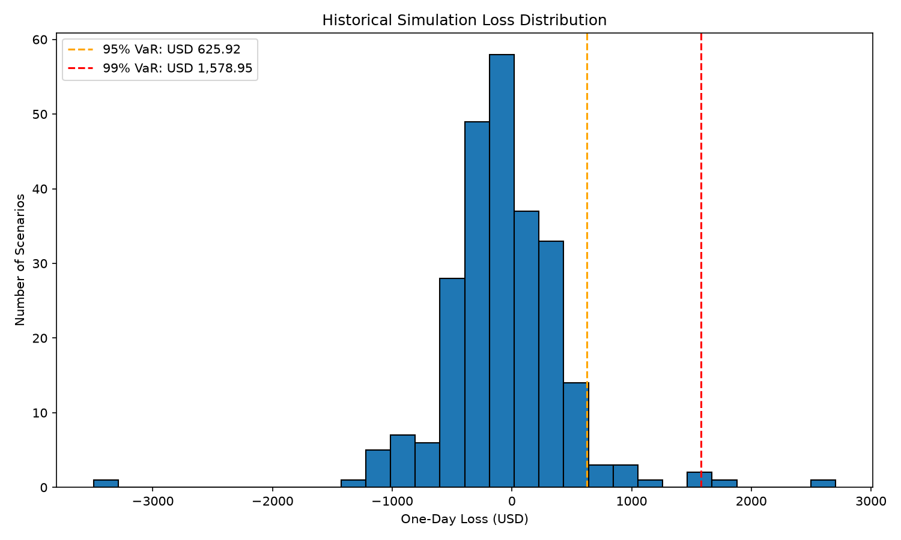
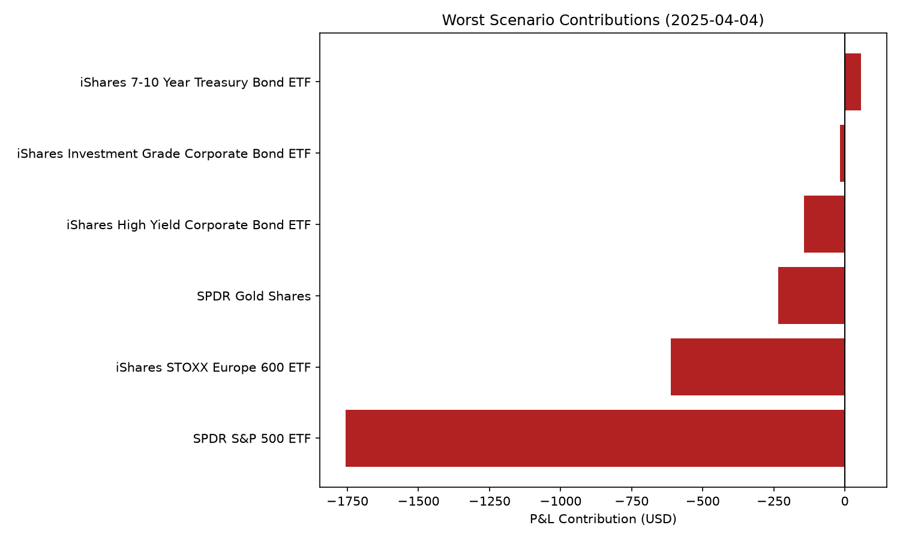
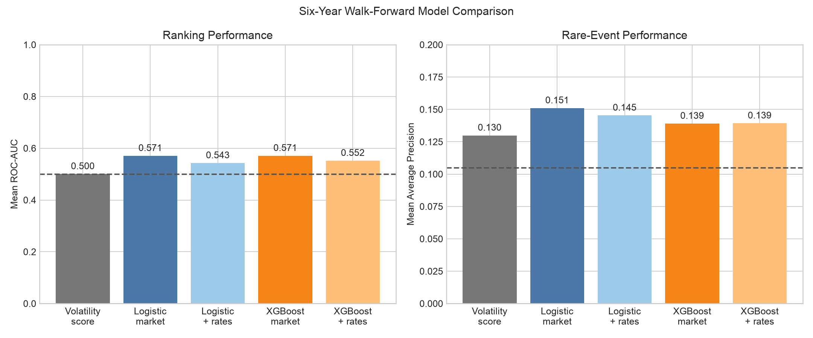
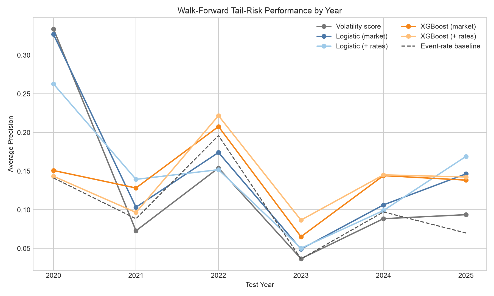
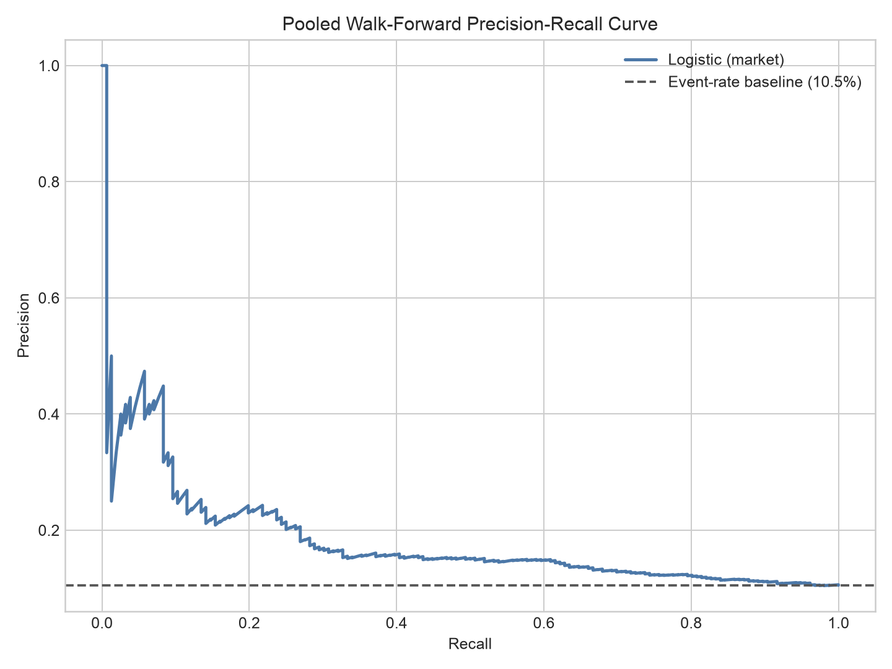
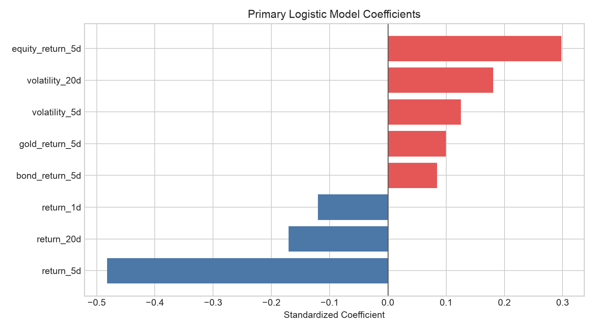
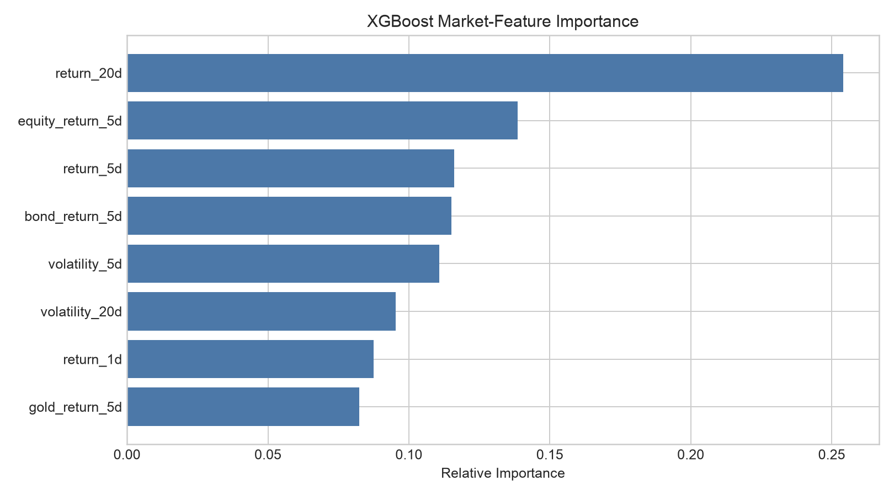

# Multi-Asset Portfolio Market Risk Engine

## Executive Summary

This case study measures and explains the one-day market risk of a hypothetical
USD 100,000 multi-asset portfolio. It combines a traditional Historical Simulation
framework with an exploratory machine-learning extension for next-day high-loss risk.

The project answers two questions:

1. How much could the portfolio lose over one trading day, and which positions drive
   the largest losses?
2. Can recent market and U.S. interest-rate information provide an early warning of a
   high-loss day?

The main conclusion is deliberately conservative: Historical VaR and Expected Shortfall
provide decision-useful loss estimates, while the predictive models show only modest and
regime-dependent signal. The prediction is treated as a monitoring aid, not a trading
system or a calibrated probability of loss.

## Portfolio and Data

The portfolio is valued at **USD 100,000** on **30 December 2025**:

| Exposure | Weight |
| --- | ---: |
| U.S. equity | 30% |
| European equity | 15% |
| U.S. government bonds | 20% |
| U.S. investment-grade corporate bonds | 15% |
| U.S. high-yield bonds | 10% |
| Gold | 10% |

Adjusted ETF prices and EUR/USD data are downloaded through Yahoo Finance for
2016–2025. The European equity position is converted from EUR to USD. The predictive
extension also uses the Effective Federal Funds Rate and 2-year and 10-year Treasury
yields from [FRED](https://fred.stlouisfed.org/).

The portfolio is hypothetical, and ETFs are used as liquid asset-class proxies.



## Historical Market-Risk Results

The risk calculation uses the latest 250 aligned daily return scenarios.

| Risk Measure | USD | % of Portfolio |
| --- | ---: | ---: |
| 95% VaR | 625.92 | 0.63% |
| 95% Expected Shortfall | 1,139.60 | 1.14% |
| 99% VaR | 1,578.95 | 1.58% |
| 99% Expected Shortfall | 1,997.08 | 2.00% |

The worst scenario occurred on **4 April 2025**, producing a loss of **USD 2,705.91
(2.71%)**. U.S. and European equities contributed approximately 87.5% of that loss.
U.S. government bonds provided a small offset, while gold also lost value. The date
coincides with a tariff-driven global selloff and subsequent retaliation reported by
[AP](https://apnews.com/article/d86db525c370e9da834e6dfb76e23b86).





## Predictive Tail-Risk Extension

### Target

A date is labeled `high_loss = 1` when the following trading day's portfolio return is
below the trailing 252-day 10th percentile. All predictors use information available on
or before the prediction date.

### Models and Features

Five fixed specifications are evaluated:

- A 20-day volatility score benchmark
- Logistic Regression with eight market features
- Logistic Regression with market and U.S. rate features
- XGBoost with eight market features
- XGBoost with market and U.S. rate features

Market features include 1-, 5-, and 20-day portfolio returns, 5- and 20-day volatility,
and recent equity, government-bond, and gold returns. Rate features include the lagged
federal funds rate, changes in 2-year and 10-year Treasury yields, and the yield-curve
slope. Rate observations are lagged by one day to avoid look-ahead bias.

### Walk-Forward Validation

The models are evaluated on six successive unseen calendar years from 2020 through
2025. For each fold, the model is retrained using only earlier observations. This design
captures changing market regimes and avoids training on future data.

| Model | Mean ROC-AUC | Mean Average Precision | Mean Precision | Mean Recall | Mean F1 |
| --- | ---: | ---: | ---: | ---: | ---: |
| Volatility score | 0.500 | 0.130 | 0.069 | 0.243 | 0.104 |
| Logistic — market | **0.571** | **0.151** | 0.135 | **0.448** | **0.204** |
| Logistic — market + rates | 0.543 | 0.145 | 0.135 | 0.363 | 0.164 |
| XGBoost — market | **0.571** | 0.139 | 0.135 | 0.409 | 0.190 |
| XGBoost — market + rates | 0.552 | 0.139 | 0.134 | 0.175 | 0.130 |

The mean high-loss event rate is 10.5%. The market-only Logistic model achieves the
highest mean Average Precision at 0.151, a 1.44x lift over the event-rate baseline. It is
selected as the primary early-warning specification because it also has the highest mean
F1 score and remains easier to explain than XGBoost.

The improvement is modest rather than production-grade. Performance varies materially
by year, and the rate-enhanced models do not improve average out-of-sample results. This
is evidence of regime dependency: macro variables that help in one period may fail to
generalize into the next.











## Latest Case-Study Prediction

Using information available on 30 December 2025, all three fitted classifiers remain
below the fixed 50% alert threshold:

| Model | High-Loss Risk Score | Classification |
| --- | ---: | --- |
| Logistic — market | 41.0% | Normal-risk class |
| XGBoost — market | 33.7% | Normal-risk class |
| XGBoost — market + rates | 24.8% | Normal-risk class |

Class balancing changes the models' score distributions, so these values are
**uncalibrated risk scores**, not literal probabilities that a loss will occur.

## Management Interpretation

- **Tail losses are materially larger than VaR.** The 95% Expected Shortfall is about
  1.82 times the 95% VaR, and the worst observed loss is more than four times the 95%
  VaR. VaR should not be interpreted as a maximum loss.
- **Equity concentration remains the main tail-risk driver.** U.S. and European equity
  exposures generated most of the worst-day loss despite the portfolio's apparent
  asset-class diversification.
- **Diversifiers are scenario-dependent.** Government bonds helped modestly on the
  worst day, but gold and credit exposures did not provide universal protection.
- **Predictive scores should only trigger review.** Low precision and unstable annual
  performance make the classifier unsuitable for automated trading or hard risk limits.
  A rising score could instead prompt scenario review, exposure checks, or more frequent
  monitoring.
- **More complexity did not reliably add value.** XGBoost did not consistently beat
  Logistic Regression, and adding interest-rate features reduced average stability. The
  simpler market-only Logistic specification is retained as the primary benchmark.

The full management discussion is available in
[`outputs/reports/management_interpretation.md`](outputs/reports/management_interpretation.md).

## Reproducibility

Create a clean environment and install the project:

```bash
python3 -m venv .venv
source .venv/bin/activate
python -m pip install -e ".[dev]"
```

Download the market and rate data, then run both analyses:

```bash
python scripts/download_market_data.py
python scripts/download_rate_data.py
PYTHONPATH=src python scripts/run_case_study.py
PYTHONPATH=src python scripts/run_predictive_model.py
```

Run the test suite and static checks:

```bash
PYTHONPATH=src python -m pytest
ruff check src scripts tests
mypy src/market_risk_engine
```

Generated tables are written to `outputs/risk_results/` and
`outputs/model_results/`. Charts are written to `outputs/charts/`.

## Repository Structure

```text
data/processed/                 Downloaded and analysis-ready CSV files
docs/                           Methodology and data dictionary
outputs/charts/                 Portfolio-ready charts
outputs/model_results/          Walk-forward metrics and predictions
outputs/risk_results/           Valuation, VaR, ES, and worst scenarios
scripts/download_market_data.py Market and FX download
scripts/download_rate_data.py   FRED interest-rate download
scripts/run_case_study.py       Historical VaR and ES analysis
scripts/run_predictive_model.py Walk-forward predictive analysis
src/market_risk_engine/         Reusable calculation functions
tests/                          Unit tests for core calculations
```

## Limitations

- Historical Simulation cannot represent shocks absent from the selected window.
- The 99% tail estimate relies on very few scenarios.
- ETF proxies do not capture every feature of the underlying asset classes.
- The high-loss label is an analytical definition, not an externally observed business
  outcome such as borrower default.
- The daily sample is small relative to typical cross-sectional machine-learning data.
- Walk-forward results are retrospective and vary considerably across market regimes.
- Model scores are not probability-calibrated.
- The analysis excludes derivatives, transaction costs, liquidity, and market impact.

This project is for educational and demonstration purposes only and does not constitute
investment advice.
